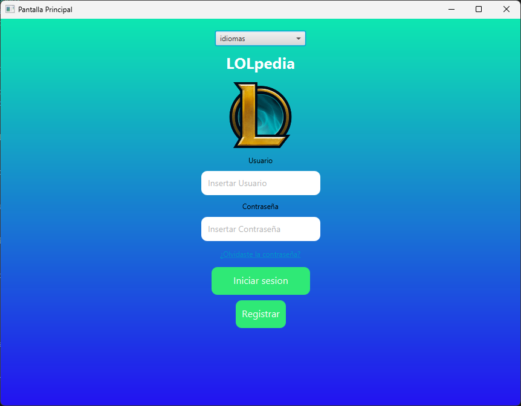
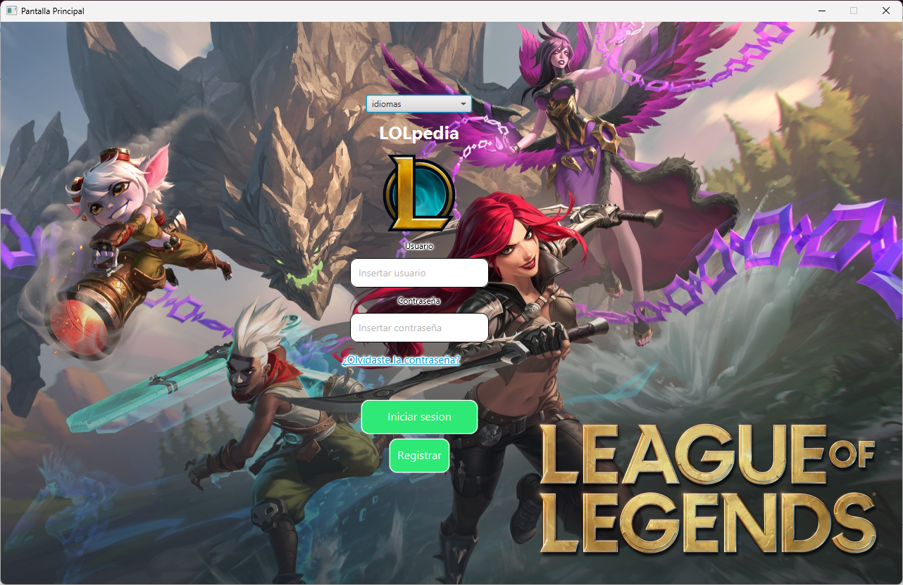

# lol-pedia-app


### Una librería interactiva de personajes de League of Legends

---

## Descripción

**lol-pedia-app** es una aplicación diseñada para brindar información detallada sobre los personajes del popular juego *League of Legends*. Este proyecto busca resolver la necesidad de los jugadores y fanáticos de acceder rápidamente a datos relevantes de los campeones, ya sea para aprender más sobre ellos o planificar estrategias.

### ¿A quién está dirigida?

- **Jugadores nuevos**: Que deseen familiarizarse con los campeones.
- **Veteranos**: Que necesiten un recurso rápido y organizado para consultar habilidades y estadísticas.
- **Entusiastas de LoL**: Que quieran explorar el trasfondo y curiosidades de sus campeones favoritos.

### ¿Qué hace única a esta app?

La app combina accesibilidad, diseño intuitivo y una base de datos rica y actualizada sobre los campeones. Además, incluye funcionalidades visuales y de búsqueda que mejoran la experiencia del usuario, destacándose frente a otras herramientas similares.

---

## Diseño

<div align="center">
  <table>
    <tr>
      <td align="center">
        
        <br/>
        <i>Wireframe inicial en Figma</i>
      </td>
    </tr>
    <tr>
      <td align="center">
        
        <br/>
        <i>Diseño final en JavaFX </i>
      </td>
    </tr>
  </table>
</div>


**Cambios clave:**
1. Mejor organización de las secciones.
2. Mejora en los colores y el diseño

---

## Tecnologías usadas

- **Java** (96.2% del proyecto)
- **CSS** (3.8% del proyecto)
- **Maven** (gestión de dependencias)
- **JavaFX** (interfaz gráfica)

---

## Instrucciones de instalación

Sigue estos pasos para ejecutar el proyecto localmente:

1. Clona el repositorio:
   ```bash
   git clone https://github.com/mahoramas/lol-pedia-app.git
   ```
2. Accede al directorio del proyecto:
   ```bash
   cd lol-pedia-app
   ```
3. Compila el proyecto con Maven:
   ```bash
   mvn clean install
   ```
4. Ejecuta la aplicación:
   ```bash
   mvn javafx:run
   ```

---

## Demo

### Vista previa en acción:


---

## Tabla de características

| Característica          | Implementado |
|-------------------------|--------------|
| Buscar campeones        | ✅           |
| Ver habilidades         | ✅           |
| Información de trasfondo| ✅           |
| Diseño responsivo       | ✅           |
| Soporte multilenguaje   | ✅           |

---

## Roadmap

### Futuras mejoras:
- Añadir información de campeones.
- Mejorar la utilidad de la app.
- Transmitir toda la información correctamente.

---
